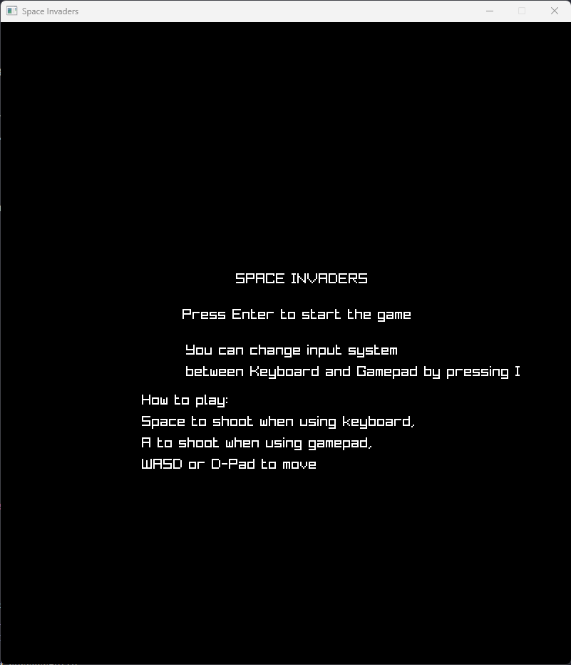
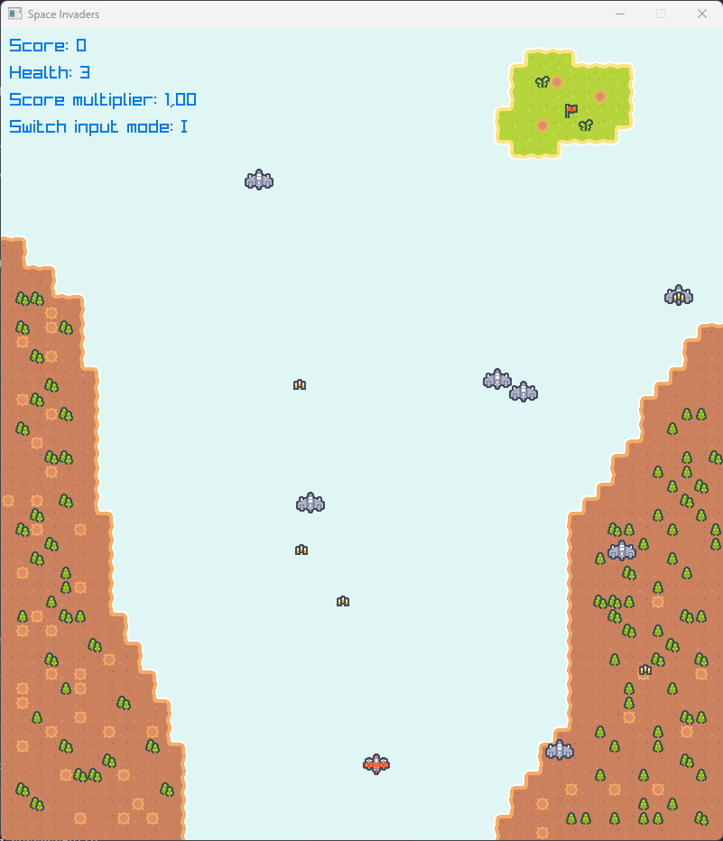
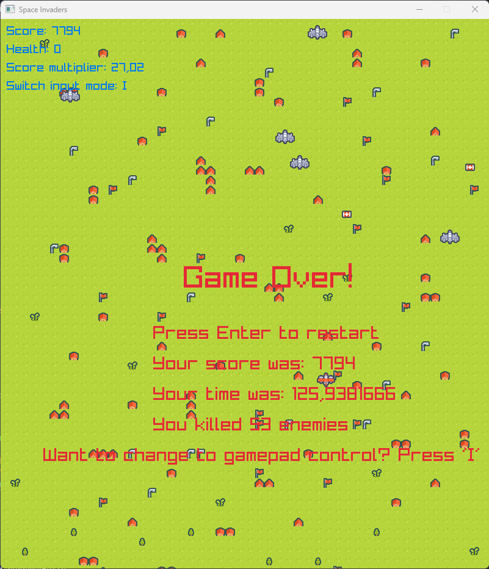

# Space Invaders Clone

## Table of Contents

- [Space Invaders Clone](#space-invaders-clone)
  - [Table of Contents](#table-of-contents)
  - [Description](#description)
  - [Gameplay](#gameplay)
  - [How to play](#how-to-play)
  - [Screenshots](#screenshots)
  - [Installation](#installation)
  - [How to build](#how-to-build)
  - [How to run without building](#how-to-run-without-building)
  - [Credits](#credits)

## Description

Space Invaders clone made with C# and Raylib.

## Gameplay

In this Space Invaders clone, you are tasked with the mission to destroy all enemies to progress to the next level. There are two types of enemies: one type moves up and down, while the other moves side to side.

Your spaceship starts with 3 health points. Be careful, as getting hit by enemy fire will cause you to lose health. However, you can replenish your health by collecting health packs scattered around the map, each of which will restore one health point.

Your ultimate goal is to navigate through all the levels. Once all enemies are defeated in a level, you can proceed to the next one by moving your spaceship to the top of the map.

If you lose all your health, the game is over, but you can restart and try again. Successfully navigating through all the levels and reaching the top of the map on the final level means you have won the game. Enjoy the challenge!

## How to play

You need to start the game using keyboard controls. Once the game is running, you can switch between keyboard and gamepad controls by pressing the `I` key.

Keyboard controls:

- Shoot: Space
- Move left: A or Left Arrow
- Move right: D or Right Arrow
- Move up: W or Up Arrow
- Move down: S or Down Arrow
- Switch input between keyboard and gamepad: I

Gamepad controls:

- Shoot: A
- Move left: D-Pad Left
- Move right: D-Pad Right
- Move up: D-Pad Up
- Move down: D-Pad Down
- Switch input between keyboard and gamepad: I

## Screenshots

## Installation

1. Download the latest release from the [releases page](https://github.com/Hamburjare/SpaceInvaders/releases)
2. Extract the contents of the zip file
3. Run the `SpaceInvaders` executable
4. Enjoy!

## How to build

1. Install the [.NET 8 SDK](https://dotnet.microsoft.com/en-us/download/dotnet/8.0)
2. Clone the repository
3. Open a terminal in the repository folder
4. Run `dotnet build -o build -c Release`
5. Open the `build` folder and run the `SpaceInvaders` executable

## How to run without building

1. Install the [.NET 8 Runtime](https://dotnet.microsoft.com/en-us/download/dotnet/8.0)
2. Clone the repository
3. Open a terminal in the repository folder
4. Run `dotnet run -c Release`
5. Enjoy!

## Credits

- [Raylib](https://www.raylib.com/)
- [2D Assets](https://kenney-assets.itch.io/pixel-shmup)
- [Sound Effects](https://sfxr.me/)
- [Tiled](https://www.mapeditor.org/)
